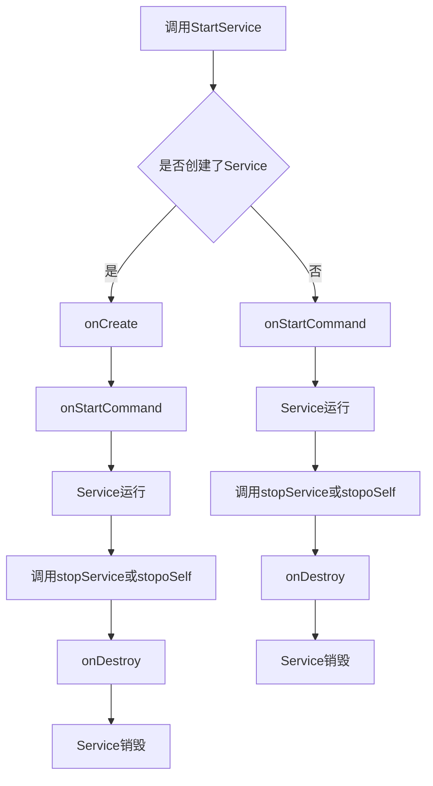

## Android中Serivice启动方式区别和工作过程分析

### Android中startService的使用及Service生命周期

当我们通过调用了Context的startService方法后，我们便启动了Service，通过startService方法启动的Service会一直无限期地运行下去，只有在外部调用Context的stopService或Service内部调用Service的stopSelf方法时，该Service才会停止运行并销毁。

要想使用Service，首先我们要继承自Service，然后重写如下方法:
**onCreate**, **onStartCommand**, **onBind** 和 **onDestroy**。




这几个方法都是回调方法，都是由Android操作系统在合适的时机调用的，并且需要注意的是这几个回调方法都是在主线程中被调用的。

**onCreate**: 执行startService方法时，如果Service没有运行的时候会创建该Service并执行Service的onCreate回调方法；如果Service已经处于运行中，那么执行startService方法不会执行Service的onCreate方法。也就是说如果多次执行了Context的startService方法启动Service，Service方法的onCreate方法只会在第一次创建Service的时候调用一次，以后均不会再次调用。我们可以在onCreate方法中完成一些Service初始化相关的操作。

**onStartCommand**: 在执行了startService方法之后，有可能会调用Service的onCreate方法，在这之后一定会执行Service的onStartCommand回调方法。也就是说，如果多次执行了Context的startService方法，那么Service的onStartCommand方法也会相应的多次调用。onStartCommand方法很重要，我们在该方法中根据传入的Intent参数进行实际的操作，比如会在此处创建一个线程用于下载数据或播放音乐等。

**onBind**: Service中的onBind方法是抽象方法，所以Service类本身就是抽象类，也就是onBind方法是必须重写的，即使我们用不到。在通过startService使用Service时，我们在重写onBind方法时，只需要将其返回null即可。onBind方法主要是用于给bindService方法调用Service时才会使用到。

**onDestroy**: 通过startService方法启动的Service会无限期运行，只有当调用了Context的stopService或在Service内部调用stopSelf方法时，Service才会停止运行并销毁，在销毁的时候会执行Service回调函数。

当Android面临内存匮乏的时候，可能会销毁掉你当前运行的Service，然后待内存充足的时候可以重新创建Service，Service被Android系统强制销毁并再次重建的行为依赖于Service中onStartCommand方法的返回值。我们常用的返回值有三种值，**START_NOT_STICKY、START_STICKY**和**START_REDELIVER_INTENT**，这三个值都是Service中的静态常量。

**START_NOT_STICKY**： 如果返回START_NOT_STICKY，表示当Service运行的进程被Android系统强制杀掉之后，不会重新创建该Service，当然如果在其被杀掉之后一段时间又调用了startService，那么该Service又将被实例化。

**START_STICKY**：如果返回START_STICKY，表示Service运行的进程被Android系统强制杀掉之后，Android系统会将该Service依然设置为started状态（即运行状态），但是不再保存onStartCommand方法传入的intent对象，然后Android系统会尝试再次重新创建该Service，并执行onStartCommand回调方法，但是onStartCommand回调方法的Intent参数为null，也就是onStartCommand方法虽然会执行但是获取不到intent信息。如果你的Service可以在任意时刻运行或结束都没什么问题，而且不需要intent信息，那么就可以在onStartCommand方法中返回**START_STICKY**，比如一个用来播放背景音乐功能的Service就适合返回该值。

**START_REDELIVER_INTENT** ：如果返回START_REDELIVER_INTENT，表示Service运行的进程被Android系统强制杀掉之后，与返回START_STICKY的情况类似，Android系统会将再次重新创建该Service，并执行onStartCommand回调方法，但是不同的是，Android系统会再次将Service在被杀掉之前最后一次传入onStartCommand方法中的Intent再次保留下来并再次传入到重新创建后的Service的onStartCommand方法中，这样我们就能读取到intent参数。只要返回**START_REDELIVER_INTENT**，那么onStartCommand重的intent一定不是null。

### Android中bindService的使用及Service生命周期

#### bindService启动服务的特点

相比于用startService启动的Service，bindService启动的服务具有如下特点:

1. bindService启动的服务在调用者和服务之间是典型的client-server的接口，即调用者是客户端，service是服务端，service就一个，但是连接绑定到service上面的客户端client可以是一个或多个。**这里特别要说明的是，这里所提到的client指的是组件，比如某个Activity、某个Service。**
2. 客户端client（即调用bindService的一方，比如某个Activity）可以通过IBinder接口获取Service的实例，从而可以实现在client端直接调用Service中的方法以实现灵活的交互，并且可借助IBinder实现跨进程的client-server的交互，这在纯startService启动的Service中是无法实现的。
3. 不同于startService启动的服务默认无限期执行（可以通过Context的stopService或Service的stopSelf方法停止运行），bindService启动的服务的生命周期与其绑定的client息息相关。当client销毁的时候，client会自动与Service解除绑定，当然client也可以通过明确调用Context的unbindService方法与Service解除绑定。当没有任何client与Service绑定的时候，Service会自行销毁（通过startService启动的除外）。
4. startService和bindService二者执行的回调方法不同：startService启动的服务会涉及Service的的onStartCommand回调方法，而通过bindService启动的服务会涉及Service的onBind、onUnbind等回调方法。

### Android中Service的工作流程分析

**Service**分为两种工作状态，一种是启动状态，主要用于执行后台计算；另一种是绑定状态，主要用于其他组件和Service的交互。需要注意的是，Service的这两种状态是可以共存的，即Service既可以处于启动状态也可以同时处于绑定状态。通过Context的startService方法即可启动一个Service，如下所示

```plain
val remoteService = Intent(this@LocalService,RemoteService::class.java)
startService(remoteService)
```

```plain
val bindServiceIntent = Intent(this@LocalService, RemoteService::class.java)
this.bindService(bindServiceIntent,connection!!,Context.BIND_ABOVE_CLIENT)
```

#### 1.1 Service的启动过程

### 参考文章

https://blog.csdn.net/oudetu/article/details/79279701
https://blog.csdn.net/iispring/article/details/48329925
https://blog.csdn.net/oudetu/article/details/79279596